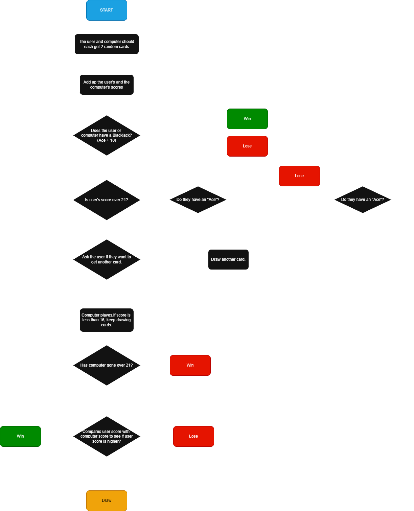

# Blackjack CLI

The Blackjack CLI Capstone Project is a simple, readable Python command-line implementation of the classic Blackjack card game. A human player plays against an automated dealer with the objective of getting as close to 21 as possible without going over. The game focuses on clean game logic: shuffling and dealing a deck, calculating hand totals (including flexible Ace values), and resolving Hit/Stand decisions.

**Project Overview**

- **Purpose:**: Small educational CLI game implementing Blackjack rules and core game mechanics.
- **Language:**: Python (single-file runner: `black_jack_game.py`).
- **Scope:**: Shuffle and deal, calculate hand values, handle Aces as 1 or 11, allow player choices, and run dealer logic.

**Gameplay**

- **Deck & Deal:**: A standard 52-card deck is shuffled; player and dealer are each dealt two cards initially.
- **Objective:**: Reach a hand total as close to 21 as possible without exceeding 21 (busting).
- **Aces:**: Aces count as 11 unless that would bust the hand, in which case they count as 1.
- **Player choices:**: On their turn the player can `Hit` (take another card) or `Stand` (end their turn).
- **Dealer rules:**: After the player stands, the dealer hits until reaching a minimum threshold (typically 17) and then stands.
- **Outcome:**: The higher valid total (<=21) between player and dealer wins; ties can be handled as pushes depending on the implementation.

**How to Play (quick)**

1. Open a terminal in the project folder.
2. Run:

```bash
python black_jack_game.py
```

3. Follow the on-screen prompts to `Hit` or `Stand`.
4. When the round finishes, the result and final hands are displayed.

**Features**

- **Shuffling & dealing:**: Randomized deck for each round.
- **Score calculation:**: Correct handling of face cards and flexible Ace values.
- **Simple CLI prompts:**: Clear player interactions for decisions and results.
- **Readable code:**: Easy to extend or modify for additional rules.

**Files**

- **`black_jack_game.py`**: Main game runner and logic.
- **`art.py`**: Optional ASCII art or helper text used by the CLI.
- **`blackjack_flow_chart.drawio`**: Flowchart diagram that describes game flow and decision points.

**Flowchart**

- The project's flowchart is included as [blackjack_flow_chart.drawio](blackjack_flow_chart.drawio). Open it with the free Diagrams.net (draw.io) desktop app or the web editor to view or export as PNG/SVG for embedding.
- If you want an image file in the repository, open the `.drawio` file in Diagrams.net and export to `PNG` or `SVG`, then add that exported file to the repo and reference it here in the README.
- An exported PNG of the flowchart is included and shown below.



**Run Locally (recommended)**

- **Create a venv (optional):**

```bash
python -m venv .venv
.\.venv\Scripts\activate
```

- **Run game:**

```bash
python black_jack_game.py
```

**Contributing**

- **Report issues:**: Open an issue describing bugs or enhancement ideas.
- **Code changes:**: Fork the repo, make changes, and submit a pull request.

**License**

- This project is provided as-is for learning and demonstration. Add a license file if you plan to publish or share more widely.
